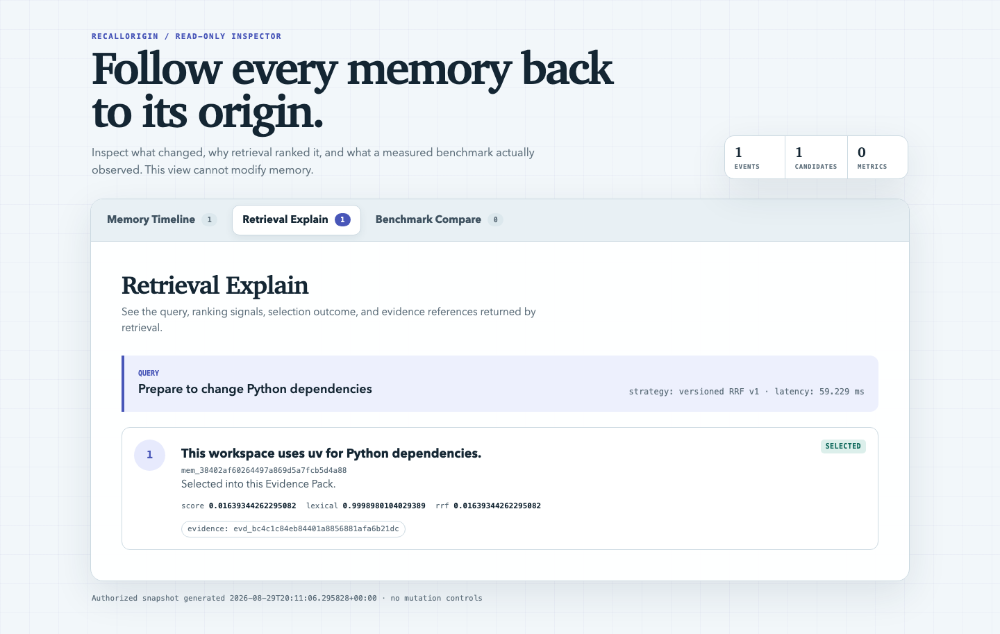
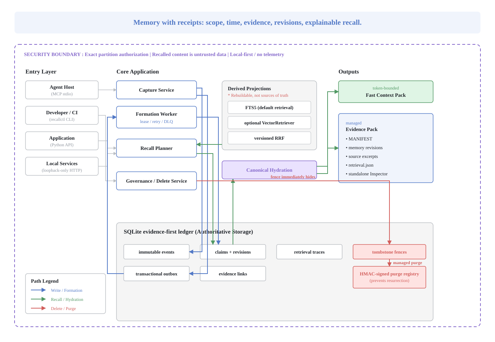
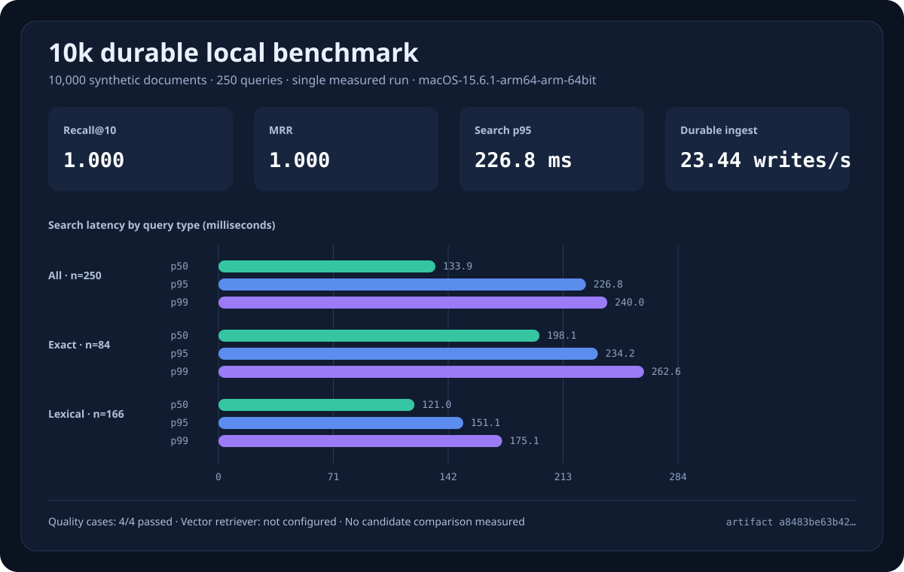

# RecallOrigin

[](https://github.com/lict1996/recall-origin/actions/workflows/ci.yml)
[](https://github.com/lict1996/recall-origin/actions/workflows/codeql.yml)
[](https://www.python.org/)
[](LICENSE)

**Memory with receipts.**

RecallOrigin is a local-first memory runtime for AI agents. It stores memories
as revisioned claims linked to evidence, keeps authorization scopes exact, and
explains why each claim was recalled.

[简体中文](README.zh-CN.md) ·
[Architecture](docs/concepts/architecture.md) ·
[Security](docs/security/threat-model.md) ·
[Reproduce the evidence](REPRODUCING.md)

> [!IMPORTANT]
> RecallOrigin `0.1.0a0` is an early alpha for one trusted machine. It is not a
> distributed high-availability service, a remote multi-tenant server, or a
> claim of state-of-the-art memory quality. The supported topology is one
> application process per store. No model-backed summarizer or extractor is
> bundled; hosts supply candidate formation when they need it.

## Why this exists

Most agent-memory demos make the write path easy but leave hard questions
unanswered:

- Who is allowed to see this memory?
- Was it true then, is it still valid now, and when did the engine learn it?
- Which event supports it?
- Did a model summarize it, or did a human confirm it?
- Why did retrieval select it?
- Can deletion reach the claim, indexes, cached packs, and restored backups?

RecallOrigin treats a memory as a **claim, not truth**. The SQLite ledger is
authoritative; FTS, optional vector results, retrieval traces, and Evidence
Packs are derived views that must hydrate through the canonical authorization
and deletion checks.

| Concern | RecallOrigin `0.1` behavior |
|---|---|
| Scope | Exact `workspace`, `user`, `agent_private`, or `session_private` partitions |
| Time | Valid time plus monotonic transaction time |
| Provenance | Immutable event, evidence link, claim, and revision lineage |
| Retrieval | Exact + FTS5, optional partition-safe vector adapter, versioned RRF |
| Injection | Returned as explicitly untrusted data, never as higher-priority instructions |
| Deletion | Immediate fence, managed-layer purge, signed anti-resurrection registry |
| Operation | Offline by default, no account, no API key, no telemetry |

## Five-minute quickstart

Install the universal wheel from the GitHub prerelease with
[`uv`](https://docs.astral.sh/uv/):

```bash
uv tool install \
  "https://github.com/lict1996/recall-origin/releases/download/v0.1.0a0/recall_origin-0.1.0a0-py3-none-any.whl"
```

For checksum and GitHub provenance verification before installation, follow
[the release-artifact procedure](REPRODUCING.md#verify-github-release-artifacts).

Create an isolated demo store, remember one fact, recall it, and export a
file-based Evidence Pack:

```bash
DEMO_DIR="$(mktemp -d)"
DEMO_DB="$DEMO_DIR/memory.sqlite3"

recallctl init --db "$DEMO_DB"
recallctl remember \
  "This workspace uses uv for Python dependencies." \
  --scope workspace:demo \
  --memory-key workspace.package_manager \
  --external-event-id quickstart-remember-001 \
  --idempotency-key quickstart-remember-001 \
  --db "$DEMO_DB"
recallctl search \
  "How are Python dependencies installed?" \
  --scope workspace:demo \
  --db "$DEMO_DB"
recallctl context \
  "Prepare to change Python dependencies" \
  --scope workspace:demo \
  --mode evidence \
  --ttl-seconds 600 \
  --out "$DEMO_DIR/evidence-pack" \
  --db "$DEMO_DB"
```

A real run returns the stored claim and creates:

```text
1. This workspace uses uv for Python dependencies. [mem_…]

evidence-pack/
├── MANIFEST.md
├── inspector.html
├── manifest.json
├── retrieval.json
├── memories/mem_….md
└── sources/evd_….json
```

The exported directory is intentionally outside RecallOrigin's managed purge
boundary. The CLI prints that warning; see
[Deletion boundaries](docs/security/deletion-boundary.md).

For a source checkout:

```bash
git clone https://github.com/lict1996/recall-origin.git
cd recall-origin
uv sync --locked --all-extras
uv run recallctl doctor --json
```

## Evidence you can inspect

An Evidence Pack is a bounded snapshot, not a hidden prompt. Its manifest
names the selected claim revisions and source excerpts, `retrieval.json`
records the content-free ranking trace, and the standalone Inspector requires
no network connection.



The managed copy has a TTL and deletion lineage. Every resource is private on
disk, path-checked, and size-bounded. Snapshot export checks every resource
against a SHA-256 manifest whose own digest is anchored in the database. The
Inspector is read-only, uses a deny-by-default Content Security Policy, and
renders stored text with `textContent`.

## Choose the smallest integration

All interfaces call the same application core. Protocol adapters do not
reimplement authorization, revisions, retrieval, or deletion.

| Interface | Best for | Entry point |
|---|---|---|
| CLI | Humans, shell automation, CI | `recallctl` |
| Python | Embedded agents and testable workflows | `MemoryEngine` |
| MCP stdio | Codex, Claude, and other MCP hosts | `python -m recall_origin.interfaces.mcp` |
| Loopback HTTP | A local process boundary | `examples/http/serve_local.py` |

### Python

```python
from pathlib import Path

from recall_origin import (
    MemoryEngine,
    OriginContext,
    PartitionRef,
    RememberRequest,
    SearchRequest,
)

scope = PartitionRef.workspace("demo")

with MemoryEngine.local(Path("/absolute/path/to/memory.sqlite3")) as memory:
    memory.remember(
        RememberRequest(
            content="This workspace uses uv.",
            scope=scope,
            memory_key="workspace.package_manager",
            external_event_id="host-event-001",
            idempotency_key="host-event-001",
            origin=OriginContext(producer_id="my-agent"),
        )
    )
    hits = memory.search(SearchRequest(query="Python dependencies", scope=scope))
```

### MCP stdio

Install the optional dependency:

```bash
python -m pip install \
  "recall-origin[mcp] @ https://github.com/lict1996/recall-origin/releases/download/v0.1.0a0/recall_origin-0.1.0a0-py3-none-any.whl"
```

Configure the host with an absolute database path and exact startup
partitions:

```json
{
  "mcpServers": {
    "recall-origin": {
      "command": "/absolute/path/to/python",
      "args": [
        "-m",
        "recall_origin.interfaces.mcp",
        "--db",
        "/absolute/path/to/memory.sqlite3",
        "--tenant-id",
        "local",
        "--principal-id",
        "coding-agent",
        "--partition",
        "workspace:example-project"
      ]
    }
  }
}
```

The default server exposes five tools:
`memory_put`, `memory_search`, `memory_context`, `memory_get`, and
`memory_feedback`. Governance and deletion tools are absent unless the server
operator explicitly enables their capabilities. See [the complete MCP
examples](examples/mcp/README.md) and the generated
[contract](contracts/mcp-tools.json).

#### The safe Agent write-to-recall loop

An Agent's explicit `memory_put(mode="remember", ...)` returns a `claim_id` and
`revision_id`, but deliberately creates an `unverified` candidate. This avoids
letting an Agent silently confirm its own summary:

1. Inspect it with `memory_search(..., include_candidates=true)`.
2. Stop the MCP host so that the store still follows the supported
   one-process topology.
3. A trusted local human reviews the content and runs:

   ```bash
   recallctl govern <claim_id> \
     --expected-revision-id <revision_id> \
     --action confirm \
     --reason "Reviewed against the cited source." \
     --db /absolute/path/to/memory.sqlite3
   ```

4. Restart the host. Normal `memory_search` and `memory_context` now return the
   active, `user_confirmed` revision.

When the proposal has a `memory_key`, confirmation and any same-key
supersession happen in the same governance transaction. Until then, an Agent
or service write—and any retained model-derived formation output—can only
create an `unverified` candidate or reinforce an existing
`candidate/unverified` head whose complete claim identity matches: exact
partition, `memory_key`, normalized content, kind, subtype, `valid_from`, and
`valid_to`. It cannot inherit confirmation from, overwrite, or supersede an
`active/user_confirmed` claim.

For a trusted fact entered directly by the local operator, `recallctl remember`
creates the active revision in one step. The full
[MCP integration guide](examples/mcp/README.md) includes release installation,
host configuration, and this lifecycle.

### Loopback HTTP

The HTTP adapter is deliberately a fixed-principal, loopback-only source
example. It is not installed as a package entry point:

```bash
git clone --branch v0.1.0a0 --depth 1 https://github.com/lict1996/recall-origin.git
cd recall-origin
uv sync --locked --extra server
uv run --extra server python examples/http/serve_local.py \
  --db /absolute/path/to/memory.sqlite3 \
  --scope workspace:example-project
```

It has no remote authentication. Do not bind it to `0.0.0.0` or place it
behind a network proxy. See [the HTTP example](examples/http/README.md) and
[OpenAPI 3.1 contract](contracts/openapi.yaml).

## Architecture



The important separation is:

1. Capture commits the event and transactional outbox together.
2. Formation produces an untrusted candidate through a leased, retryable job.
3. Claims, revisions, and evidence links remain authoritative in SQLite.
4. Exact, FTS, and optional vector candidates are fused with versioned RRF.
5. Every result is canonically re-hydrated before a Fast or Evidence Context
   Pack is returned.
6. Deletion fences win over readers, workers, indexes, and old backups.

Read the [architecture](docs/concepts/architecture.md), [data
model](docs/concepts/data-model.md), and accepted [ADRs](docs/adr/).

## Memory formation and trust

- A local human explicitly remembering a semantic or episodic claim creates an
  active, `user_confirmed` revision.
- Procedural memory remains a candidate until governance activates it.
- Agent and service writes remain `unverified` candidates. Like retained
  model-derived output, they may reinforce only a `candidate/unverified` head
  with the same complete claim identity; they cannot inherit or displace
  trusted state.
- Only a Human write that produces `active/user_confirmed`, or a Human
  `govern(confirm)`, can supersede other live claims under the same
  `memory_key`. `govern(confirm)` commits confirmation and supersession in one
  transaction.
- `capture` durably stores an event and outbox job. It does **not** claim that
  extraction already succeeded.
- The included `StructuredEventProvider` accepts schema-checked candidates
  from hosts that already perform extraction. No model-backed extractor is
  bundled in this alpha.
- Instruction-like automatic candidates are quarantined; recalled content is
  still untrusted even after activation.

## Retrieval semantics

Retrieval is performed inside one authorized exact partition. RecallOrigin
combines:

1. stable-key/exact matches;
2. SQLite FTS5 lexical candidates;
3. an optional vector adapter only if it enforces exact partition filtering;
4. deterministic, versioned reciprocal-rank fusion;
5. canonical checks for partition, revision, valid time, evidence
   availability, and deletion fences.

Raw FTS/vector scores, RRF score, final rank score, selected IDs, configuration,
and degradation reasons remain distinct. Scores are ranking signals, not
probabilities that a claim is true.

## Deletion contract

RecallOrigin reports deletion in three separate layers:

1. **Logical invisibility** — the committed fence immediately hides matching
   data from every engine read path.
2. **Engine-managed purge** — canonical text, FTS, jobs, traces, and managed
   Evidence Packs are removed with per-layer status.
3. **External copies** — exported files, filesystem/cloud snapshots, offline
   backups, and provider retention are reported as outside direct control.

In this alpha, `forget` performs the first layer; an operator must explicitly
run Python purge or `recallctl purge` for managed physical cleanup. MCP and
HTTP do not expose that purge operation. Target semantics are deliberate:
purging a claim does not erase its supporting event/evidence body, and
deleting one event from a multi-source claim can retain the claim text while
other live evidence remains.

A signed purge registry lives beside the main database and is not rolled back
with an old database snapshot. Restore refuses a missing, stale, or invalid
registry rather than silently resurrecting deleted content.

Purge removes managed content bodies but intentionally retains some linkable
audit metadata, including caller-supplied IDs, `memory_key`, `subject_id`, and
revision reasons. Do not put erasable text, direct PII, or email addresses in
those fields. See the exact [deletion and retained-metadata
matrix](docs/security/deletion-boundary.md).

## Reproducible evidence, not a leaderboard claim

The repository includes two different kinds of evidence:

- reliability gates for idempotency, compare-and-swap, worker lease takeover,
  deletion races, abnormal shutdown, read-only failures, migration, and
  backup-restoration non-resurrection;
- a deterministic offline retrieval benchmark at `100`, `10k`, `100k`, or
  `1M` documents.

The small corpus is a synthetic smoke test. It is not evidence of broad
real-world answer quality. The vector baseline is `null` when no vector
adapter is configured; RecallOrigin never substitutes an estimate.

The checked-in 10k durable run is one sequential measurement on macOS arm64:



| Measured on 10,000 synthetic documents | Result |
|---|---:|
| Required behavioral cases | 4/4 |
| Recall@10 / MRR | 1.000 / 1.000 (250 queries) |
| Search p50 / p95 / p99 | 133.909 / 226.763 / 239.992 ms |
| Durable end-to-end ingest | 23.437 writes/s |
| SQLite footprint | 41,177,088 bytes |
| Whole command wall clock | 465.59 s |

These unique-marker queries measure deterministic retrieval correctness and
regression behavior, not production semantic relevance. The run is not a
cross-system comparison, has no vector arm, and does not establish a latency
SLO. Its canonical artifact SHA-256 is
`a8483be63b42dd93422ba74d4c3bf07cd6bb5a8f55c9c79ed9480826ded96387`.

See [benchmark methodology](docs/benchmarks/README.md) and
[the complete measured artifact](docs/benchmarks/results/README.md), plus
[reproduction instructions](REPRODUCING.md). Published numbers are generated
from the checked-in artifact, not estimated.

## Development

```bash
uv sync --all-extras
uv run pytest
uv run ruff check .
uv run ruff format --check .
uv run mypy --strict src scripts
uv run --extra mcp python scripts/generate_mcp_contract.py --check
uv run python scripts/reliability_gate.py
```

Release builds and the README quickstart are also tested in clean virtual
environments. See [CONTRIBUTING.md](CONTRIBUTING.md),
[SECURITY.md](SECURITY.md), and [REPRODUCING.md](REPRODUCING.md).

## Current limits

- SQLite provides a high-reliability single-machine core, not distributed HA.
- One application process may own a store and managed pack root. Do not point
  independent MCP, HTTP, Python, or worker processes at the same store.
- The loopback HTTP adapter does not implement remote authentication or
  enterprise multi-tenancy.
- FTS5 is the zero-configuration baseline; no vector implementation is
  installed by default.
- No hosted sync, web control plane, graph database, or telemetry is included.
- Exported Evidence Packs and external provider copies cannot be purged by the
  engine.
- Physical purge and automatic formation processing require an explicit
  operator call; no always-on supervisor is bundled.
- Benchmark coverage is not yet a substitute for LongMemEval-V2, LoCoMo, or
  independent downstream reproduction.

The detailed list is maintained in [docs/limitations.md](docs/limitations.md);
planned work is in [docs/roadmap.md](docs/roadmap.md).

## Contributing and license

Issues that include a failing fixture, threat model, adapter contract, or
reproducible benchmark are especially useful. Please read
[CONTRIBUTING.md](CONTRIBUTING.md) before opening a pull request and report
security issues through [SECURITY.md](SECURITY.md), not a public issue.

RecallOrigin is licensed under [Apache License 2.0](LICENSE).
