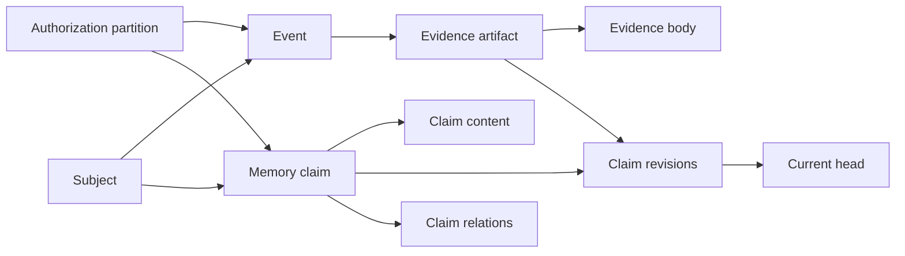

# Data model

RecallOrigin stores observations, claims about those observations, and policy
state as separate records. This separation lets the engine answer three
different questions: what happened, what the engine currently claims, and
which evidence and governance transition produced that state.

## Core lineage

The diagram shows lineage, not authorization inheritance. Every protected
lineage table also carries `partition_id`, and subject identity never grants
access.

## Identity and authorization

### `partitions`

A partition is the exact storage and authorization boundary. Its logical
identity is `(tenant_id, namespace_kind, namespace_id)`; its stable internal
ID is derived from those fields. `cancellation_epoch` fences in-flight
formation work after broad deletion. A partition tombstone also permanently
rejects new persistent writes to that identity in the alpha.

### `partition_grants`

The schema can represent principal-to-partition capabilities. In the current
alpha, runtime authorization is instead supplied through the fixed
`PrincipalContext` and exact `allowed_partitions` at startup. The table is not
yet an administrative policy source.

### Origin and subject

Event origin fields include session, host agent, producer, request ID, and
origin type. They are provenance only. `subjects`, `event_subjects`, and
`claim_subjects` describe what data is about and support subject deletion;
they are not access-control lists.

Subject deletion relies on those explicit links. Its fence key is
`(partition_id, subject_id)`, without a `subject_type` discriminator, and it
permanently rejects future persisted requests that explicitly name the same
subject ID. Untagged text mentions have no subject lineage and cannot be
selected by that fence.

## Observation and evidence

### `ledger_transactions`

Each committed logical mutation receives a monotonically increasing `tx_seq`.
This sequence resolves transaction order even when wall-clock timestamps are
equal or skewed.

### `events` and `event_payloads`

An event records identity, partition, origin, formation mode, event time,
recorded time, and ledger sequence. Its payload is stored separately so purge
can remove content while retaining minimal event lineage.

Explicit and automatic formation share the event model. Replay identity is
unique within a partition and producer. Deleted events retain a fence so the
same external identity cannot reintroduce their content.

### `evidence_artifacts` and `evidence_bodies`

An artifact records provenance, digest, availability, and optional URI.
Content or excerpt lives in a separate body row. A revision links to an
ordered evidence set through `revision_evidence`; the set receives a stable
digest.

Canonical reads require at least one accessible `available` evidence artifact
with a body and no matching event fence. `source_count` in a stored revision
is audit state at creation time; current responses recompute live source
availability.

## Claim and revision

### `memory_claims` and `claim_contents`

A claim fixes:

- one partition;
- kind and subtype;
- optional `memory_key`;
- valid-time interval;
- origin type and creating event;
- immutable claim text and normalized text.

The complete reinforcement-match identity is `(partition, memory_key,
normalized_content, kind, subtype, valid_from, valid_to)`. A non-null
`memory_key` and equality across every field are required; “same content under
the same key” elsewhere in the documentation is shorthand for this full tuple.
The origin type and creating event remain immutable creation lineage; later
events can add revision evidence without changing them.

Changing any match-identity field creates a distinct claim. Deleted or restored
fenced lineage is never reused.

### Claim-transition authority

The policy gate may independently reject or quarantine formation output. Agent
and service `remember` calls, and retained automatic/model-derived proposals,
can do only one of the following:

- create a distinct `candidate/unverified` proposal; or
- reinforce an unfenced current head only when the complete identity matches
  and that head is itself `candidate/unverified`.

Those paths never select an `active/user_confirmed` head for reinforcement,
copy its status or confirmation, or transition it to `superseded`. A same-key
proposal with different content—or any other identity mismatch—therefore
coexists as a candidate while the confirmed claim remains active.

Only a Human explicit write whose resulting state is `active/user_confirmed`,
or a Human `govern(confirm)`, can supersede other unfenced live claims under
the same partition and `memory_key`. The trusted write and its supersession
share one database transaction. For `govern(confirm)`, the expected-revision
CAS, new `active/user_confirmed` revision, head update, and same-key
supersession all commit or roll back together.

### `memory_revisions`

A revision records policy and evidence state without changing the claim text:

- status, such as `candidate`, `active`, `quarantined`, `superseded`, or
  `tombstoned`;
- confirmation, such as `unverified` or `user_confirmed`;
- evidence-set digest and source count;
- previous revision, reason, actor, action, and `tx_from_seq`.

Revisions are append-only in normal operation. `revision_history` derives each
revision's transaction-time end from the next revision rather than rewriting
the old row. The alpha keeps revision `reason` and actor identifiers as
lineage metadata during purge; those fields must not contain erasable content
or direct personal identifiers.

### `claim_heads`

The head is a rebuildable mutable projection pointing to the current revision.
Governance and reinforcement advance it with compare-and-swap. A stale
expected revision fails instead of silently overwriting concurrent work.

### `memory_relations`

Relations express `supersedes`, `conflicts_with`, `supports`, `derived_from`,
or `related_to` edges between claims in the same exact partition. They explain
lineage; they do not bypass canonical hydration.

## Bitemporal fields

RecallOrigin separates valid time from transaction time:

| Question | Stored field |
|---|---|
| When did an observed event happen? | `events.occurred_at` (`event_time` in the public contract) |
| When did RecallOrigin ingest it? | `events.recorded_at` |
| When is the claim meaningful in the represented world? | `memory_claims.valid_from` / `valid_to` |
| When did the engine adopt a revision? | `memory_revisions.tx_from_seq` and `revision_time` |

Current retrieval uses the present valid time and the current head. Historical
retrieval with `known_at_seq` selects the latest revision whose transaction
sequence was already known, then applies `valid_at`. Privacy tombstones are
not historical data: they override every valid-time and transaction-time
query.

See [ADR-0004](../adr/0004-bitemporal-time-model.md).

## Formation and feedback

`outbox_messages` stores durable jobs with attempts, availability time,
lease owner, lease generation, cancellation epoch, and terminal state.
`formation_runs` records provider and policy fingerprints.
`derived_candidates` records schema-validated proposals and their disposition.
Provider output never directly becomes trusted confirmation.

`memory_feedback` is append-only user or agent feedback. It does not
automatically change claim status or truth.

## Retrieval projections

`claim_fts` is a disposable FTS5 projection of canonically eligible current
claims. It is never authoritative and can be rebuilt. A stale index hit still
must pass canonical hydration.

`retrieval_runs` stores a bounded, expiring explanation: a keyed query digest,
query shape, component ranks and scores, selected opaque IDs, latency, and
degradation reasons. It deliberately does not store the raw query or claim
content.

An optional vector adapter is outside the SQLite schema. It returns claim IDs
and scores; the engine performs exact-partition canonical hydration before
returning anything.

## Evidence Packs

`managed_packs` anchors each managed filesystem pack to one partition,
retrieval trace, manifest digest, lifecycle status, and expiry.
`managed_pack_claims` and `managed_pack_evidence` record deletion lineage.
The registered root path is operational state, not an authority grant: reads
and removals accept it only while it remains a direct child of the currently
configured managed-pack root.

The pack directory contains `manifest.json`, `MANIFEST.md`,
`retrieval.json`, `inspector.html`, memory documents, and accessible evidence
excerpts. Managed resources are derived snapshots, not a second source of
truth.

## Deletion records

`deletion_requests` records the typed target, idempotency hash, state, and
external-copy warning. `deletion_layers` reports logical visibility,
authoritative text, FTS, and managed-pack progress separately.
`tombstone_fences` is the main-database projection of the independent purge
registry.

The sidecar database holds a signed state head and an append-only,
generation-ordered tombstone hash chain. The main database stores the latest
verified registry checkpoint. On open, current sidecar fences are merged into
the main database before normal access. If an authenticated tombstone has no
matching deletion request and its partition exists, the same transaction
materializes the minimal request and layer rows needed to continue status and
purge by the original deletion ID. A later forget of the same typed target
adopts that recovered lifecycle instead of creating a second deletion.

Physical purge is the only intended exception to content immutability:
payload, evidence, candidate, claim, index, trace, or pack content may be
removed while lineage and deletion receipts remain. That retained lineage is
not uniformly opaque; see the deletion boundary for fields that can remain
linkable or textual.

Target-specific removal semantics are documented in
[Deletion boundary](../security/deletion-boundary.md).

## Authoritative versus derived

| Category | Data |
|---|---|
| Authoritative lineage | partitions, ledger transactions, events, evidence metadata, claims, revisions, heads, relations, formation and deletion state |
| Separately purgeable content | event payloads, evidence bodies, claim contents, candidate payloads |
| Rebuildable or expiring projection | FTS rows, current views, retrieval traces |
| Managed derived files | Evidence Pack directory and Inspector |
| External and unmanaged | exported packs, copied databases, OS/cloud snapshots, provider retention |

For identity semantics, see [ADR-0001](../adr/0001-claim-revision-identity.md);
for evidence semantics, see
[ADR-0005](../adr/0005-evidence-retention.md).
